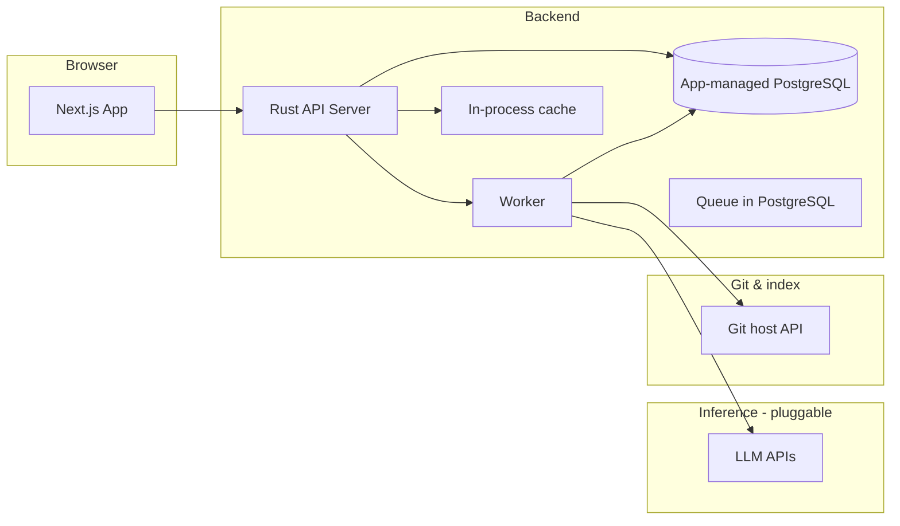

# System Architecture

## High-level components



- **Next.js (React)**: founder-facing UI (**phase 1:** no login—launch → onboarding or app), dashboards for tickets/workspaces, inbox for decisions and hiring.
- **Rust API**: authoritative domain logic, persistence, **phase 1:** loopback-trusted access (no JWT), enqueue of agent jobs.
- **Worker** (same binary as API or dedicated mode): dequeues jobs from **PostgreSQL**, calls a **provider registry** (`InferenceProvider` trait) for chat completion, writes results and events back to DB.
- **PostgreSQL**: source of truth for companies, agents, tickets, audit logs—and for the **job queue** (`agent_jobs` + `SKIP LOCKED`). **No separate database install**: the app starts or bundles Postgres and owns the data directory (see [11-embedded-runtime-data.md](./11-embedded-runtime-data.md)).
- **Cache**: **in-process** (e.g. TTL/LRU); no Redis required for the default install.
- **LLM providers:** phase 1 typically **Ollama** over HTTP on loopback/LAN; future: OpenAI, Anthropic, Gemini, etc. **Never expose API keys or vendor URLs to the browser**—only the backend talks to providers ([12-ai-provider-extensibility.md](./12-ai-provider-extensibility.md)).
- **Git & knowledge:** backend stores **encrypted Git credentials** from onboarding, calls **Git host REST APIs** to **create private org repos** and to **fetch file trees** for indexing; **embeddings** stored in Postgres (**pgvector**) and queried at agent time ([13-git-integration-and-knowledge-index.md](./13-git-integration-and-knowledge-index.md)).

## Zero pre-setup install (default product shape)

End users should **not** pre-install PostgreSQL, Redis, or a queue product. The installer or first-run flow:

1. Creates an application data directory.
2. Initializes and starts **app-managed PostgreSQL** (bundled binary or equivalent).
3. Runs migrations.
4. Starts API + worker + serves the Next UI (how the UI is served—static export next to binary vs local URL—is an implementation detail).

Developers may still use Docker or a system Postgres for convenience, but **production parity** should be tested against the embedded path.

## Recommended repository layout (monorepo)

```
/apps/web          # Next.js
/crates/api        # HTTP API (axum or similar)
/crates/worker     # agent runner (or merge into api with feature flags)
/crates/domain     # pure types, validation
/crates/db         # sqlx or diesel migrations + queries
/crates/git-host   # GitHub/GitLab API adapters (create repo, contents)
/crates/knowledge  # chunking, embedding trait, RAG retrieval
/packages/shared-types  # optional: OpenAPI-generated TS types
```

Alternative: separate repos—only worth it if teams split; early on, monorepo reduces friction.

## API style

- **REST** or **JSON-RPC**—pick one and generate types for the frontend (e.g. OpenAPI → TypeScript).
- **Versioned** routes: `/v1/...`.
- **Idempotent** job creation where possible (avoid duplicate agent runs for the same ticket step).

## Real-time updates (choose one)

| Approach | Pros | Cons |
|----------|------|------|
| Polling | Simple | Noisy, laggy |
| SSE | Simple one-way push | One connection per tab |
| WebSocket | Bidirectional | More operational complexity |

**Suggestion for MVP:** SSE or short polling; upgrade later if the inbox UX needs instant updates.

## Deployment models

1. **Local-first (phase 1 default):** founder installs or runs one app bundle: **embedded Postgres + API + worker + UI**; **Ollama** (or compatible endpoint) remains the user’s responsibility for local inference. Later, cloud keys are stored server-side per AI profile. No Docker or manual DB setup required for the product install.
2. **Developer optional:** Docker Compose with a normal Postgres image is fine for **dev/CI** if faster than spinning embedded DB every test run.
3. **Hosted (later):** managed Postgres; API/worker on a VPS or cloud; could keep PG-backed queue or introduce Redis **only** if you scale to multiple stateless API instances—document as a separate deployment mode from the zero-setup local app.

## Observability

- Structured logs (tracing) in API and worker with **correlation IDs** per agent run.
- Persist **run transcripts** (summaries + optional full text) for debugging and UX “activity feed.”

## Failure modes

- **Inference unavailable** (Ollama down, rate limit, invalid key): jobs fail gracefully; ticket stays “in progress” or moves to “blocked” with a machine-readable error including `provider_kind` when known.
- **Long-running generation:** timeouts, partial saves, resume tokens (even if MVP only supports “retry job”).
