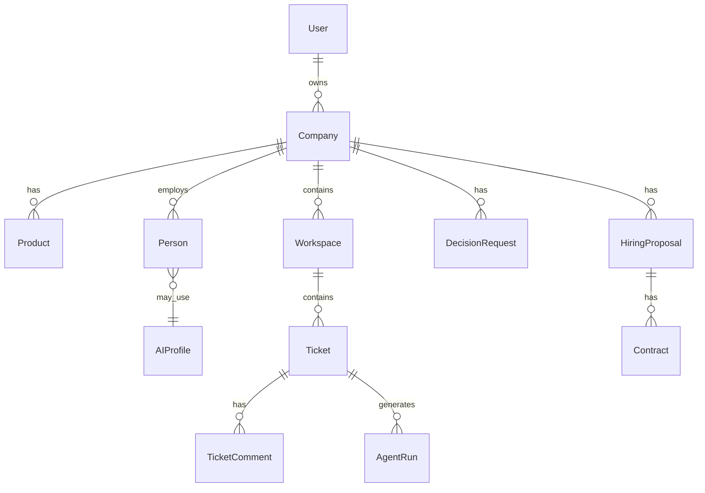

# Domain Model

## Aggregate roots (conceptual)

### Company

- Identity: `id`, `name`, `slug`, `created_at`
- Owner: `founder_user_id` (the human account)
- Settings: timezone, “autonomy level” (how often to escalate—tunable later)
- Optional **Git linkage** via `git_integration` / `git_repository` (see [13-git-integration-and-knowledge-index.md](./13-git-integration-and-knowledge-index.md))

### Git integration & repositories

- **`git_integration`:** one active integration per company (MVP): `git_host_kind`, org/namespace, encrypted token, verification status.
- **`git_repository`:** remotes the app created or linked; `default_branch`, `last_indexed_commit`, purpose (product code, docs, …).
- **`knowledge_chunk`:** indexed text + **vector embedding** for RAG; tied to company and optionally `git_repository_id`.

### Product

- Belongs to **one company** (MVP: one flagship product per company; allow many later)
- Fields: `name`, `description`, `status` (idea / discovery / spec / …)

### Person (workforce member)

Represents both **human** (founder) and **AI** roles in a unified table or with a discriminator.

Suggested fields:

- `company_id`
- `kind`: `human_founder` | `ai_agent`
- `display_name`
- `role_type`: `co_founder` | `ceo` | `cto` | `specialist` | …
- `specialty` (for specialists: e.g. “market research”, “finance”, “growth”)
- `ai_profile_id` (nullable for humans): links to provider config

### AI profile (provider configuration)

**Extensible multi-provider shape** (see [12-ai-provider-extensibility.md](./12-ai-provider-extensibility.md)):

- `provider_kind`: stable slug, e.g. `ollama`, `openai_api`, `anthropic`, `google_gemini`, `azure_openai` (enum in code + unknown forward-compatible handling).
- `model_id`: **vendor opaque string** (e.g. `llama3.2`, `gpt-4o`, `claude-sonnet-4-20250514`).
- `provider_config` (JSONB, versioned per kind): e.g. Ollama `{ "schema_version": 1, "base_url": "http://127.0.0.1:11434" }`; OpenAI `{ "schema_version": 1, "base_url": null }` or Azure endpoint fields—avoid wide sparse columns.
- **Encrypted credentials** stored separately from JSONB (or encrypted envelope)—API keys for cloud providers; optional key for Ollama.
- `default_temperature`, `default_max_tokens` (optional overrides).

**Phase 1 product:** only `ollama` appears in onboarding/hiring pickers; **database and worker** accept the full model for later enable-list expansion.

Store secrets **encrypted at rest**; never return raw secrets to client—only “configured / not configured” plus non-sensitive fields.

### Workspace (Jira “project” analog)

- `company_id`
- `name` (e.g. “R&D”, “Marketing”, “Finance”)
- `key` or `slug` (short prefix for tickets)
- `purpose` (free text or enum)
- `created_by` (which agent or founder)

### Ticket

- `workspace_id`
- `title`, `description`
- `type`: `task` | `epic` | `research` | … (keep small in MVP)
- `status`: e.g. `backlog` | `todo` | `in_progress` | `blocked` | `done`
- `priority`
- `assignee_person_id` (nullable)
- `parent_ticket_id` (optional hierarchy)
- Audit: `created_by`, `updated_by`, timestamps

### Ticket event / comment

- Append-only comments for human readability
- Optional **structured events** (JSON) for machine actions: `status_changed`, `agent_run_started`, …

### Agent run (execution unit)

- `ticket_id` (nullable if run is company-level)
- `triggered_by`: `scheduler` | `founder` | `agent`
- `actor_person_id` (which AI role executed)
- `state`: `queued` | `running` | `succeeded` | `failed`
- `input_summary`, `output_summary`
- `provider_kind`, `model_id` (snapshot at run time for audit even if profile changes later)
- `raw_transcript_ref` (object storage or large text column—policy in security doc)

### Decision request (escalation to founder)

- `company_id`
- `created_by_person_id` (CEO/CTO/etc.)
- `title`, `context` (markdown)
- `options` (optional JSON: multiple choice)
- `status`: `open` | `answered` | `cancelled`
- `resolution` (founder text or selected option)
- `blocks_ticket_ids` (many-to-many or list) — what is paused until answered

### Hiring proposal and contract

**Proposal** (initiated by an agent or founder):

- `company_id`, `proposed_by_person_id`
- `rationale`
- `status`: `draft` | `pending_founder` | `accepted` | `declined` | `withdrawn`

**Contract** (versioned terms the founder signs off):

- `proposal_id`
- `employee_display_name`
- `role_type` / `specialty`
- `ai_profile` snapshot or `ai_profile_id` (frozen at acceptance)
- `compensation_narrative` (optional flavor text; not real money in MVP)
- `status`: `pending` | `accepted` | `declined`
- `founder_response_text` (reason on decline; optional note on accept)

On **accept**, materialize a new **Person** (`ai_agent`) and attach the **AI profile**.

## Entity relationship (sketch)

## Authorization rules (MVP)

- **Phase 1 (local, no login):** the desktop/web UI and API share a **single trust boundary** (localhost). Any `founder_user_id` foreign key can be **nullable** or point at a single synthetic “local founder” row—no password, no JWT. All human-facing routes effectively have full access to companies in this database.
- **Later:** founder user can read/write only their `company_id` after real auth is added.
- AI agents have **server-side** permissions only (no direct browser API as “agent user” in phase 1); the worker acts with a **service role** scoped by `company_id` + `actor_person_id` audit.

## Migration strategy

- Start normalized; add JSONB for **flex metadata** on tickets/workspaces if iteration speed matters.
- Keep **contract snapshot** immutable on acceptance for auditability.
