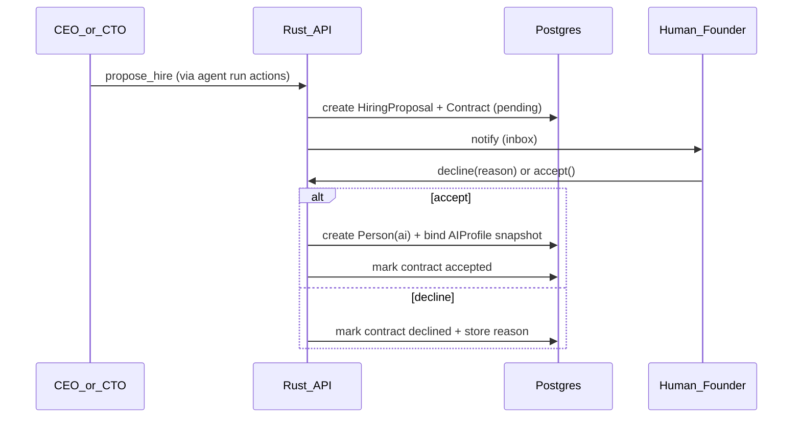

# Hiring and Founder Approvals

## Goals

- Preserve founder **agency** over team expansion.
- Make each hire a **reviewable artifact** (contract) with clear AI configuration.
- Keep an **audit trail**: who proposed, why, accept/decline reason.

## Flow

## Contract fields (minimum)

- **Employee display name** (e.g. “Alex—Market Research”)
- **Role type** / **specialty**
- **AI profile snapshot**: `provider_kind`, `model_id`, non-secret `provider_config`, encrypted credential reference—same shape as [02-domain-model.md](./02-domain-model.md) / [12-ai-provider-extensibility.md](./12-ai-provider-extensibility.md) (phase 1 UI: Ollama only; contract stores full profile for audit)
- **Reporting line** (optional): e.g. reports to CTO—helps prompts
- **Scope of work** (markdown): what they are allowed to do autonomously
- **Proposal rationale** (from agent)

## Founder actions

- **Accept** — materialize `Person`; optionally enqueue a **welcome run** (agent introduces themselves as a comment on a company-level ticket or team page).
- **Decline** — **reason required**; store visible to proposing agent in next context (so it can adjust).

## Permissions

- Only **founder user** can accept/decline.
- Agents cannot mutate a contract once pending (withdrawal could be a later feature).

## Edge cases

- **Duplicate names:** allow but warn in UI; suggest suffix.
- **Invalid AI profile:** validate on submit; test connection optional before accept.
- **Concurrent proposals:** show list; independent decisions.

## Future: templates

Save **hire templates** (“Junior researcher”, “Copywriter”) to speed proposals while still requiring founder sign-off.
