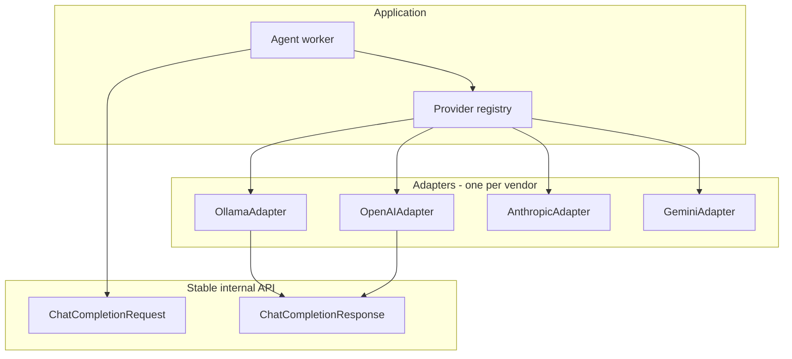

# AI Provider Extensibility (Ollama Today, OpenAI / Claude / Gemini Later)

## Design goals

1. **One internal contract** for “run an agent turn”: messages in, text (or structured JSON) out—provider differences stay in **adapters**.
2. **Provider and model are data**, not hardcoded: stored on `AIProfile` so CEO vs CTO vs hire can each use different backends.
3. **Phase 1 ships only the Ollama adapter enabled in UI**, but **schemas, traits, and job pipeline** assume multiple providers from day one.
4. **Adding a provider** should mean: implement adapter + register it + (optional) UI fields + migrations only if new columns are unavoidable—prefer **versioned JSON config** for provider-specific settings.

## Conceptual layers



- **Worker** never imports vendor SDK details directly; it asks the **registry** for `dyn InferenceProvider` (or enum of boxed traits) keyed by `provider_kind`.
- **ChatCompletionRequest** is normalized: `messages: Vec<Message>`, `model: String`, `temperature`, `max_tokens`, optional `response_format` (e.g. JSON mode where supported).

## Provider identification

### `provider_kind` (enum, open for extension)

Store as a string or enum in DB; new values deploy with code.

Suggested initial set (not all implemented in phase 1):

| `provider_kind` | Typical auth | Notes |
|-----------------|--------------|--------|
| `ollama` | Optional; base URL | Local / LAN |
| `openai_api` | API key / org | Chat Completions / Responses API |
| `anthropic` | API key | Messages API |
| `google_gemini` | API key / ADC | Generative Language API |
| `azure_openai` | Endpoint + API key + deployment | Deployment name acts like model |

Use **stable snake_case slugs** in DB; map to Rust enum with `#[non_exhaustive]` or unknown variant fallback for forward compatibility.

### Model identifier

- Store **opaque `model_id` string** as the vendor expects (e.g. `gpt-4o`, `claude-sonnet-4-20250514`, `gemini-2.0-flash`, `llama3.2`).
- Optional future table **`model_catalog`** (provider_kind, model_id, display_name, capabilities) for UI pickers—can start as static JSON in repo per provider.

## AI profile storage (flexible config)

**Recommended pattern:** fixed columns for routing + **JSONB `provider_config`** validated per `provider_kind`.

Fixed columns (illustrative):

- `id`, `company_id`, `display_name` (optional label for UI)
- `provider_kind` (text or enum)
- `model_id` (text)
- `default_temperature`, `default_max_tokens` (nullable overrides)
- `provider_config` (JSONB)—**provider-specific**, schema-versioned inside JSON e.g. `{ "schema_version": 1, "base_url": "..." }` for Ollama; `{ "schema_version": 1 }` for key-only APIs
- `secrets_ref` or encrypted blob for **API keys** (never plain in JSONB if logs replicate DB)

**Why JSONB:** OpenAI needs no base URL (or custom base for Azure); Ollama needs base URL; Gemini might need `api_version` or `location` later—avoid wide sparse SQL columns.

## Rust module layout (suggested)

```
crates/ai-core          # ChatCompletionRequest/Response, Message, errors
crates/ai-providers     # trait InferenceProvider + registry
crates/ai-provider-ollama
crates/ai-provider-openai   # phase 2+
crates/ai-provider-anthropic
crates/ai-provider-gemini
```

```rust
// Conceptual — not prescriptive syntax
pub trait InferenceProvider: Send + Sync {
    fn kind(&self) -> ProviderKind;
    async fn complete(&self, req: ChatCompletionRequest) -> Result<ChatCompletionResponse, AiError>;
    async fn health_check(&self) -> Result<(), AiError>;
}
```

- **Registry** builds the right adapter from `AIProfile` row (decrypt secrets, parse `provider_config`).
- **Feature flags** or compile-time features can omit heavy SDK crates until needed.

## Capabilities matrix (plan ahead, implement lazily)

Not every provider supports the same options. Track per adapter:

| Capability | Use |
|------------|-----|
| `json_mode` / constrained output | Stronger guarantee for agent action JSON |
| `streaming` | Future UI |
| `tool_calls` | Future native tools instead of JSON-in-text |
| `max_context_estimate` | Context pack budgeting |

Worker **falls back**: if `json_mode` unsupported, use prompt discipline + parse/repair as today.

## Frontend extensibility

- **Provider picker:** drive from backend `GET /v1/ai-providers` listing **enabled** kinds + required fields schema (JSON Schema or custom DTO) so onboarding and hiring forms render without a hardcoded Ollama-only form.
- **Phase 1:** API returns only `ollama` with its field schema; later, add rows or config for OpenAI, etc.
- **Secrets:** never echo API keys; use “replace key” flows.

## Agent run audit

- Persist on `agent_run`: `provider_kind`, `model_id` (denormalized snapshot) so history stays interpretable if profile later changes.

## Testing strategy

- **Contract tests** per adapter with **recorded HTTP fixtures** (mockito/wiremock) or VCR-style.
- **Fake provider** implementing `InferenceProvider` returning deterministic JSON for E2E tests without network.
- Live Ollama/OpenAI tests behind env flags.

## Rollout order (suggested)

1. **Phase 1:** Ollama adapter + registry with one entry; generic request type in worker.
2. **Phase 2:** OpenAI or Anthropic (whichever your customers ask for first); encrypted API key UX.
3. **Phase 3:** Remaining cloud providers + optional `model_catalog` UX.
4. **Ongoing:** capability detection, pricing/rate-limit metadata (optional).

## Summary

- **Extendible by design:** trait + registry + `provider_kind` + JSONB `provider_config` + opaque `model_id`.
- **Phase 1 scope unchanged:** only Ollama **enabled**, but code structure **multi-provider-ready** so OpenAI, Claude, and Gemini are **adapters + UI schema**, not rewrites.
