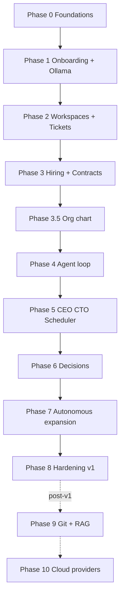

# Implementation Phases — Design & Sequencing

This document **designs how implementation phases fit together**: dependencies, parallel work, quality gates, and pointers to detailed deliverables in [10-implementation-phases.md](./10-implementation-phases.md). Use it for **roadmapping, sprint planning, and hiring scope**; use doc **10** as the **checklist** per phase.

## Objectives of the phase model

1. **Ship the company simulation MVP first:** onboarding → AI + co-founder → **tickets** (including “hire CEO/CTO”) → **contracts** → **organization chart (reporting lines)** → **agent loop** that does ticket work → **executive roles + scheduler**. **Git and RAG are explicitly not on the critical path** (Phase 9).
2. **Tickets are the unit of work:** hiring is expressed as tickets assigned to the co-founder (then CEO, etc.); execution is the **agent loop**, not a separate “hiring wizard” only.
3. **Preserve extensibility:** inference trait/registry from day one; **optional** Git + embeddings layer lands when the core loop is proven.

## Phase map (IDs and names)

| ID | Name | Summary |
|----|------|---------|
| **0** | Foundations | Monorepo, embedded Postgres, queue tables, no auth, minimal company/product |
| **1** | Onboarding + inference | Wizard, `AIProfile`, Ollama adapter + registry, **co-founder** |
| **2** | Workspaces & tickets | CRUD + UI; hiring work modeled as tickets |
| **3** | Hiring & contracts | Proposals, founder accept/decline, roles (CEO/CTO/…), new `Person` |
| **3.5** | **Organization chart** | Reporting lines (manager / reports); tree UI; cycle-safe APIs |
| **4** | Agent loop | Worker, JSON actions, **`propose_hire`**, MVP context pack + **org** (no RAG) |
| **5** | CEO & CTO + scheduler | Role prompts, autonomous ticks, executives on hiring tickets |
| **6** | Decisions inbox | Escalations, blocking tickets |
| **7** | Autonomous expansion | Policies, workspace/ticket expansion, activity feed, rate limits |
| **8** | Hardening & release | **v1 ship:** backups, tests, install runbook |
| **9** | Git + knowledge index | PAT, repos, pgvector, indexer, **RAG** in context pack |
| **10** | Cloud LLM providers | OpenAI / Anthropic / Gemini enable-list |

## Dependency graph

Main line for **v1:** **0 → 1 → 2 → 3 → 3.5 → 4 → 5 → 6 → 7 → 8**. **Phase 9** and **10** are **post–v1** enhancements; they do not block ticket execution or hiring.

**Rule:** do not slip **Git** into Phase 1–8 as a **gate** for MVP. If you spike Git early, keep it **off** the MVP exit criteria until Phase 9.

## Quality gates (before starting the next phase)

| After | Gate (must be true) | Before starting |
|-------|---------------------|-----------------|
| **0** | App starts, embedded DB migrates, company+product persist, no manual Postgres | **1** |
| **1** | Onboarding completes; Ollama test passes; co-founder exists | **2** |
| **2** | Workspace + ticket + comment + status + assignee path (as far as people exist) | **3** |
| **3** | Accept hire → new `Person` with role; CEO/CTO can exist via contracts | **3.5** |
| **3.5** | Org chart + reporting lines editable; acyclic graph | **4** |
| **4** | Agent run mutates ticket; `propose_hire` creates pending contract | **5** |
| **5** | Scheduler runs; CEO/CTO advance tickets in demo | **6** |
| **6** | Decision blocks / unblock | **7** |
| **7** | Expansion policies + feed demonstrable | **8** |
| **8** | Clean install on another machine | **9** or **10** (optional) |

## Parallel work streams (small team)

| Stream | Typical work | Handoff |
|--------|----------------|---------|
| **Platform** | Embedded PG, migrations, job tables, worker | Stable job + agent APIs |
| **Product UI** | Onboarding, workspaces, tickets, **hiring inbox**, **org chart** | Shared types from Rust |
| **AI** | `InferenceProvider`, prompts, JSON actions | Worker consumes schema |

**Rule:** **05-ai-runtime** + **02-domain-model** own the action contract; avoid parallel edits without coordination.

## Effort bands (indicative, solo senior dev)

| Phase | Band | Notes |
|-------|------|-------|
| 0 | 0.5–2 wk | Embedded PG |
| 1 | 1–2 wk | Wizard + profile + Ollama |
| 2 | 1–2 wk | CRUD + ticket as hiring surface |
| 3 | 1–2 wk | Contracts + roles + inbox |
| 3.5 | 0.5–1.5 wk | `reports_to` + validation + org chart UI |
| 4 | 2–3 wk | Worker + parser + first prompts |
| 5 | 1–2 wk | Role prompts + scheduler |
| 6 | ~1 wk | Decisions |
| 7 | 1–2 wk | Policies + feed |
| 8 | 1–2 wk | Docs + CI |
| 9 | 2–4 wk | Git API + indexer + pgvector |
| 10 | 2+ wk | First cloud adapter hardest |

**v1 (0–8):** roughly **~2–4 months** solo full-time depending on Phase 4 depth—**faster** than a plan that front-loads Git+RAG.

## Mapping to architecture docs

| Topic | Primary docs |
|-------|--------------|
| Product intent | [00-vision-and-scope.md](./00-vision-and-scope.md) |
| System shape | [01-system-architecture.md](./01-system-architecture.md) |
| Entities, org / reporting | [02-domain-model.md](./02-domain-model.md) |
| API & worker | [03-backend-rust.md](./03-backend-rust.md) |
| Frontend | [04-frontend-next.md](./04-frontend-next.md) |
| Agents & context | [05-ai-runtime.md](./05-ai-runtime.md) |
| Workspaces/tickets | [06-workspaces-and-tickets.md](./06-workspaces-and-tickets.md) |
| Hiring | [07-hiring-and-approvals.md](./07-hiring-and-approvals.md) |
| Escalations | [08-notification-and-escalation.md](./08-notification-and-escalation.md) |
| Security | [09-security-and-compliance.md](./09-security-and-compliance.md) |
| Embedded data | [11-embedded-runtime-data.md](./11-embedded-runtime-data.md) |
| Multi-LLM future | [12-ai-provider-extensibility.md](./12-ai-provider-extensibility.md) |
| Git & index | [13-git-integration-and-knowledge-index.md](./13-git-integration-and-knowledge-index.md) |

## What “v1” means vs later

- **v1 (Phases 0–8):** Ollama-first; **no** Git index requirement; **hiring + org chart + tickets + agent loop + executives**; contracts always gate hires.
- **Post–v1:** **Phase 9** Git + RAG; **Phase 10** cloud providers; multi-user auth and OAuth—see [10-implementation-phases.md](./10-implementation-phases.md) risks.

## How to use this in sprint planning

1. Lock **current phase** and **exit criteria** from doc **10**.
2. Tasks should map to **demo artifacts** (e.g. “hire CEO via contract → set CEO **reports to** co-founder on org chart → run ticket”).
3. If tempted to add Git early, **park** it under Phase 9 unless you are explicitly time-boxing a spike.

---

**Detailed per-phase bullets** → [10-implementation-phases.md](./10-implementation-phases.md).
