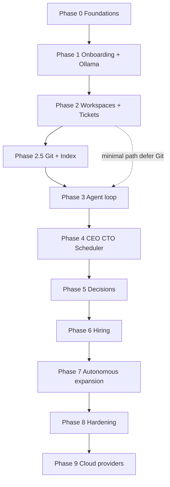

# Implementation Phases — Design & Sequencing

This document **designs how implementation phases fit together**: dependencies, parallel work, quality gates, and pointers to detailed deliverables in [10-implementation-phases.md](./10-implementation-phases.md). Use it for **roadmapping, sprint planning, and hiring scope**; use doc **10** as the **checklist** per phase.

## Objectives of the phase model

1. **Reduce risk:** prove embedded Postgres + API + UI shell before AI, AI before autonomy, autonomy before hiring/decisions complexity.
2. **Preserve extensibility:** traits/registries (inference, Git host, embeddings) land before features that depend on them.
3. **Enable incremental demos:** each phase should produce something **demoable** to a founder (except Phase 0, which is internal).

## Phase map (IDs and names)

| ID | Name | Summary |
|----|------|---------|
| **0** | Foundations | Monorepo, embedded Postgres, queue tables, no auth, minimal company/product |
| **1** | Onboarding + inference core | Wizard (company/product/AI), `AIProfile`, Ollama adapter + registry |
| **2** | Workspaces & tickets | Jira-lite CRUD + UI |
| **2.5** | Git + knowledge index | PAT, private org repos, pgvector, indexer jobs, RAG data plane |
| **3** | First agent loop | Worker, JSON actions, context pack + optional RAG |
| **4** | CEO & CTO + scheduler | Roles, prompts, autonomous tick |
| **5** | Decisions inbox | Escalations, blocking tickets |
| **6** | Hiring & contracts | Proposals, founder accept/decline, new `Person` |
| **7** | Autonomous expansion | `create_workspace`, activity feed, rate limits |
| **8** | Hardening & release | Backups, tests, install runbook |
| **9** | Cloud LLM providers | OpenAI / Anthropic / Gemini enable-list (post–v1) |

## Dependency graph

Phases run **mostly linearly**; the main branch is **0 → 1 → 2 → 3 → 4 → 5 → 6 → 7 → 8**. **2.5** is a **branch** off **2** (needs stable company + onboarding shell) and **must complete before Phase 3** if you want RAG in the first agent loop; if you defer Git, ship Phase 3 with empty index and add 2.5 later (not ideal—plan says integrate in 2.5 before 3).

**Recommendation:** treat **2.5 → 3** as the default path so RAG is not a retrofit.

## Quality gates (before starting the next phase)

| After | Gate (must be true) | Before starting |
|-------|---------------------|-----------------|
| **0** | App starts, embedded DB migrates, company+product persist, no manual Postgres | **1** |
| **1** | Onboarding completes; Ollama test passes; co-founder profile exists | **2** |
| **2** | User can create workspace + ticket + comment + status change in UI | **2.5** or **3** |
| **2.5** | Git test + private repo create + index job completes + chunks &gt; 0 (or explicit “index failed” UX) | **3** (if RAG in v1) |
| **3** | One agent run mutates ticket/comment; parser validates actions | **4** |
| **4** | Scheduler runs; demo script shows cross-role progress | **5** |
| **5** | Open decision blocks work; answer unblocks | **6** |
| **6** | Accept hire → new assignable AI person | **7** |
| **7** | Agent creates workspace/tickets per policy; feed shows events | **8** |
| **8** | Clean install documented; another machine succeeds | **9** (optional) |

## Parallel work streams (small team)

When **two people** (or one person time-slicing), split by **boundary**:

| Stream | Typical phases / work | Handoff |
|--------|----------------------|---------|
| **Platform** | Embedded Postgres, migrations, job tables, worker skeleton, tracing | Stable `internal` API for jobs |
| **Product UI** | Next routes, onboarding wizard, ticket list/detail | OpenAPI or shared types from Rust |
| **AI / integrations** | `InferenceProvider`, Ollama, later GitHub adapter, embeddings, RAG retrieval | Trait + DTOs consumed by worker |

**Rule:** avoid two owners editing the same **agent action schema** without pairing—keep **05-ai-runtime** and **02-domain-model** as contract sources.

## Effort bands (indicative, solo senior dev)

Rough **calendar** guidance only; adjust for scope creep and part-time work.

| Phase | Band | Notes |
|-------|------|--------|
| 0 | 0.5–2 wk | Embedded PG is the long pole |
| 1 | 1–2 wk | Wizard + profile + Ollama |
| 2 | 1–2 wk | Straightforward CRUD |
| 2.5 | 2–4 wk | Git API + pgvector + indexer reliability |
| 3 | 2–3 wk | Action parser + transactions + UX for runs |
| 4 | 1–2 wk | Prompts + scheduler |
| 5 | 1 wk | Inbox + block semantics |
| 6 | 1–2 wk | Contracts + materialize person |
| 7 | 1–2 wk | Policies + feed |
| 8 | 1–2 wk | Docs + CI + polish |
| 9 | 2+ wk each provider | First cloud provider hardest |

**v1 total (0–8):** on the order of **~3–4 months** solo full-time if Git+RAG is in scope; faster without 2.5 or with reduced indexing scope.

## Mapping to architecture docs

| Topic | Primary docs |
|-------|----------------|
| Product intent | [00-vision-and-scope.md](./00-vision-and-scope.md) |
| System shape | [01-system-architecture.md](./01-system-architecture.md) |
| Entities | [02-domain-model.md](./02-domain-model.md) |
| API & worker | [03-backend-rust.md](./03-backend-rust.md) |
| Frontend | [04-frontend-next.md](./04-frontend-next.md) |
| Agents & RAG context | [05-ai-runtime.md](./05-ai-runtime.md) |
| Workspaces/tickets | [06-workspaces-and-tickets.md](./06-workspaces-and-tickets.md) |
| Hiring | [07-hiring-and-approvals.md](./07-hiring-and-approvals.md) |
| Escalations | [08-notification-and-escalation.md](./08-notification-and-escalation.md) |
| Security | [09-security-and-compliance.md](./09-security-and-compliance.md) |
| Embedded data | [11-embedded-runtime-data.md](./11-embedded-runtime-data.md) |
| Multi-LLM future | [12-ai-provider-extensibility.md](./12-ai-provider-extensibility.md) |
| Git & index | [13-git-integration-and-knowledge-index.md](./13-git-integration-and-knowledge-index.md) |

## What “v1” means vs later

- **v1 (Phases 0–8):** local-first, Ollama-first, optional Git+RAG, no cloud LLM in enable-list unless you pull Phase 9 forward.
- **Post–v1 (Phase 9+):** additional `provider_kind` values, OAuth for Git, webhooks for index, multi-user auth—see risks in [10-implementation-phases.md](./10-implementation-phases.md).

## How to use this in sprint planning

1. Lock **current phase** and **exit criteria** from doc **10**.
2. Break deliverables into **tasks** with **one owner** and a **demo artifact** (screenshot, API call, or script).
3. Do not start the **next** phase until the **gate** row above is satisfied (or explicitly waive with a documented tech debt ticket).
4. Revisit **2.5 vs 3** order if Git scope slips: document whether v1 ships **without** RAG or **delays** Phase 3.

---

**Detailed per-phase bullets** → [10-implementation-phases.md](./10-implementation-phases.md).
